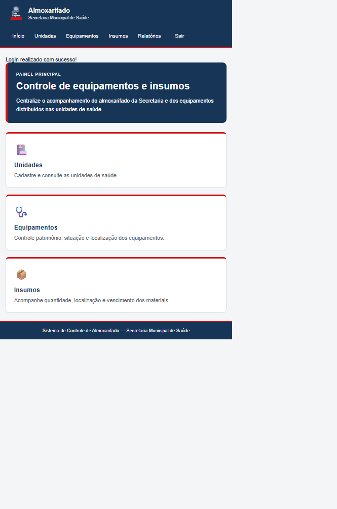

# Almoxarifado | Secretaria Municipal de Saúde

Aplicação web para centralizar o controle de unidades de saúde, equipamentos clínicos e insumos em uma base única, substituindo planilhas e registros dispersos.

## Visão geral

O sistema oferece um painel administrativo simples para cadastrar, consultar, editar e excluir registros do almoxarifado. Equipamentos ficam vinculados às unidades de saúde, enquanto os insumos podem permanecer no almoxarifado central ou ser associados a uma unidade.

## Demonstração

> A captura abaixo mostra a tela principal do sistema.



## Recursos

- Cadastro e consulta de unidades de saúde.
- Organização das unidades por grupo da rede e tipo de estabelecimento.
- Cadastro de equipamentos vinculados a uma unidade.
- Controle de patrimônio, modelo, marca, número de série e situação do equipamento.
- Registro de insumos no almoxarifado central ou nas unidades.
- Controle de quantidade, localização, lote, fabricação, entrega e vencimento.
- Indicadores de itens vencidos e próximos do vencimento.
- Edição e exclusão de registros com validações.
- Relatórios para exportação em CSV.
- Acesso protegido por login administrativo.

## Tecnologias

| Tecnologia | Finalidade |
| --- | --- |
| Python 3 | Linguagem principal |
| Flask | Aplicação web, rotas e autenticação |
| SQLite | Banco de dados local |
| Jinja | Templates HTML dinâmicos |
| HTML e CSS | Interface do sistema |

## Requisitos

- Python 3.10 ou superior.
- PowerShell no Windows ou um terminal equivalente no Linux/macOS.
- Git, caso o projeto seja obtido de um repositório.

## Instalação

### Windows PowerShell

```powershell
python -m venv .venv
.\.venv\Scripts\Activate.ps1
pip install -r requirements.txt
```

### Linux ou macOS

```bash
python3 -m venv .venv
source .venv/bin/activate
pip install -r requirements.txt
```

## Execução

O banco é criado automaticamente quando a aplicação é iniciada. Para criá-lo separadamente, use `criar_banco.py`.

```bash
python criar_banco.py
python app.py
```

Abra [http://127.0.0.1:5000](http://127.0.0.1:5000) no navegador.

## Acesso e configuração

Em ambiente local, as credenciais padrão são:

| Campo | Valor padrão |
| --- | --- |
| Usuário | `admin` |
| Senha | `admin` |

Antes de usar o sistema em produção, altere as credenciais e defina uma chave de sessão forte:

```powershell
$env:ADMIN_USER = "seu_usuario"
$env:ADMIN_PASS = "sua_senha"
$env:SECRET_KEY = "uma_chave_secreta_forte"
python app.py
```

## Comandos úteis

Verificar as tabelas existentes no banco local:

```bash
python verificar_banco.py
```

Executar a aplicação em um servidor compatível com WSGI:

```bash
gunicorn app:app
```

## Estrutura do projeto

```text
almoxerifado_secretaria_saude/
├── app.py                    # Aplicação Flask e rotas
├── models.py                 # Modelos auxiliares
├── schema_almoxarifado.sql   # Estrutura do banco SQLite
├── requirements.txt          # Dependências Python
├── criar_banco.py            # Criação do banco local
├── verificar_banco.py        # Verificação das tabelas
├── templates/                # Páginas HTML com Jinja
│   ├── base.html
│   ├── index.html
│   ├── login.html
│   ├── unidades.html
│   ├── equipamentos.html
│   ├── insumos.html
│   ├── editar_unidade.html
│   ├── editar_equipamento.html
│   └── editar_insumo.html
├── static/                   # CSS, logo e favicon
├── docs/                     # Imagens da documentação
└── .gitignore
```

## Banco de dados

O arquivo `almoxarifado.db` é criado na raiz do projeto durante a execução local. Ele contém as tabelas de unidades, equipamentos, insumos e movimentações.

O banco local não deve ser versionado. Para iniciar um ambiente limpo, remova o arquivo e execute novamente `python criar_banco.py`.

## Produção

Para um ambiente de produção:

1. Troque o usuário, a senha e a `SECRET_KEY` padrão.
2. Use um servidor WSGI, como Gunicorn.
3. Mantenha o banco e os segredos fora do controle de versão.
4. Configure backups regulares do banco SQLite.