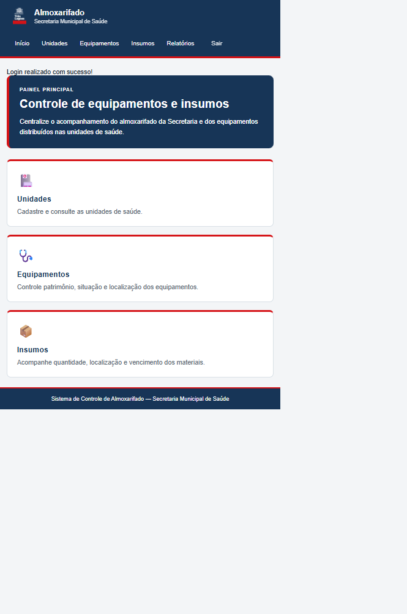

<div align="center">


# Sistema de Controle de Almoxarifado

### Secretaria Municipal de Saúde · Três Lagoas/MS

Aplicação web para gestão de unidades de saúde, equipamentos clínicos e insumos.

<br>

[](https://www.python.org/)
[](https://flask.palletsprojects.com/)
[](https://www.sqlite.org/)
[](#)

</div>

---

## Sobre o sistema

O **Sistema de Controle de Almoxarifado** centraliza informações relacionadas às unidades de saúde, equipamentos clínicos e insumos da Secretaria Municipal de Saúde.

A aplicação foi criada para reduzir a dependência de planilhas e registros dispersos, permitindo uma consulta mais rápida, organização padronizada e melhor acompanhamento dos materiais distribuídos nas unidades.

> Equipamentos são vinculados a unidades de saúde. Insumos podem permanecer no almoxarifado central ou ser associados a uma unidade específica.

## Funcionalidades

| Área | Recursos |
|---|---|
| 🏥 **Unidades** | Cadastro, consulta, edição e exclusão de unidades de saúde |
| 🩺 **Equipamentos** | Controle de patrimônio, marca, modelo, número de série, situação e localização |
| 📦 **Insumos** | Controle de quantidade, lote, localização, fabricação, entrega e vencimento |
| 📊 **Relatórios** | Indicadores gerenciais e exportação de dados em CSV |
| 🔐 **Acesso** | Autenticação com e-mail institucional e senha protegida |
| ⚠️ **Alertas** | Identificação de materiais vencidos e próximos do vencimento |

## Painel administrativo

O sistema possui um painel inicial com atalhos para as principais áreas de gestão:

- 🏥 Unidades de saúde
- 🩺 Equipamentos clínicos
- 📦 Insumos e materiais
- 📊 Relatórios gerenciais
- ⚠️ Indicadores de vencimento

## Demonstração

> Tela inicial do sistema.



> Relatórios gerenciais e indicadores de almoxarifado.


## Tecnologias utilizadas

| Tecnologia | Utilização |
|---|---|
| **Python 3** | Linguagem principal |
| **Flask** | Rotas, páginas, autenticação e aplicação web |
| **SQLite** | Banco de dados local |
| **Jinja2** | Templates HTML dinâmicos |
| **HTML5 / CSS3** | Interface responsiva e identidade visual |
| **Werkzeug** | Proteção de senhas com hash |

## Requisitos

- Python 3.10 ou superior
- PowerShell no Windows, ou terminal no Linux/macOS
- Git, caso o projeto seja clonado de um repositório

## Instalação

### Windows

```powershell
git clone URL_DO_REPOSITORIO
cd almoxarifado_secretaria_saude

python -m venv .venv
.\.venv\Scripts\Activate.ps1

pip install -r requirements.txt
```

### Linux ou macOS

```bash
git clone URL_DO_REPOSITORIO
cd almoxarifado_secretaria_saude

python3 -m venv .venv
source .venv/bin/activate

pip install -r requirements.txt
```

## Execução

Com o ambiente virtual ativado, execute:

```bash
python app.py
```

Acesse no navegador:

```text
http://127.0.0.1:5000
```

Caso o projeto utilize o script separado para banco de dados:

```bash
python criar_banco.py
python app.py
```

## Acesso ao sistema

O sistema utiliza autenticação por e-mail institucional e senha armazenada de forma protegida no banco de dados.

Por segurança:

- Usuários, e-mails e senhas não são publicados no repositório.
- Credenciais iniciais são configuradas apenas no ambiente local ou no servidor.
- Senhas e `SECRET_KEY` devem ser fornecidas por variáveis de ambiente.
- O banco SQLite local não deve ser versionado.
```

## Comandos úteis

### Consultar tabelas do banco

```bash
python verificar_banco.py
```

### Executar com servidor WSGI

```bash
gunicorn app:app
```

> Para implantação com Gunicorn, prefira um ambiente Linux. No Windows, utilize uma alternativa WSGI compatível ou execute a aplicação por meio de um servidor Linux.

## Estrutura do projeto

```text
almoxarifado_secretaria_saude/
├── app.py                     # Aplicação Flask, rotas e regras do sistema
├── requirements.txt           # Dependências do projeto
├── criar_banco.py             # Criação do banco, se utilizado
├── verificar_banco.py         # Consulta das tabelas, se utilizado
├── schema_almoxarifado.sql    # Estrutura inicial do banco, se utilizado
│
├── templates/                 # Templates HTML com Jinja2
│   ├── base.html
│   ├── login.html
│   ├── index.html
│   ├── unidades.html
│   ├── equipamentos.html
│   ├── insumos.html
│   ├── relatorios.html
│   ├── editar_unidade.html
│   ├── editar_equipamento.html
│   └── editar_insumo.html
│
├── static/                    # Arquivos estáticos
│   ├── style.css
│   ├── logo.png
│   ├── logosms.jpg
│   ├── logoprefeitura.jpg
│   └── favicon.png
│
├── docs/                      # Capturas utilizadas no README
│   ├── tela-inicial.png
│   └── relatorios.png
│
├── instance/                  # Banco SQLite local, se utilizado
└── .gitignore
```

## Banco de dados

O sistema utiliza SQLite para armazenar os dados de:

- Usuários e credenciais protegidas
- Unidades de saúde
- Equipamentos
- Insumos
- Informações utilizadas nos relatórios

O banco de dados local não deve ser enviado ao GitHub.

Para iniciar uma base limpa, faça backup das informações necessárias, remova o arquivo `.db` local e execute novamente a aplicação ou o script de criação do banco.

## Segurança

Antes de disponibilizar o sistema em produção:

1. Configure uma `SECRET_KEY` exclusiva, longa e aleatória.
2. Não envie arquivos `.env`, banco SQLite, senhas ou chaves para o Git.
3. Use senhas fortes para os usuários institucionais.
4. Configure backups periódicos do banco de dados.
5. Utilize HTTPS e um servidor WSGI apropriado.
6. Restrinja o acesso ao servidor e aos arquivos de backup.
7. Considere PostgreSQL caso o sistema cresça em volume de usuários ou dados.

## Arquivos ignorados pelo Git

O arquivo `.gitignore` deve conter ao menos:

```gitignore
.env
.venv/
venv/
__pycache__/
instance/
*.db
*.sqlite
*.sqlite3
```

---

<div align="center">

Desenvolvido para a **Secretaria Municipal de Saúde**  
Prefeitura Municipal de Três Lagoas/MS

**Cada dia melhor!**

</div>